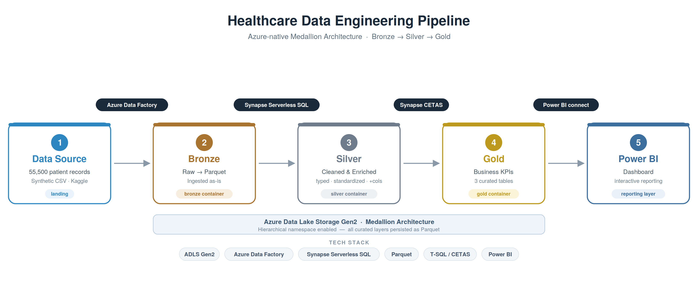

# Healthcare Data Engineering Pipeline (Azure-Native)

An end-to-end, **serverless** data engineering project on Microsoft Azure that ingests raw healthcare admission data, refines it through a **Bronze → Silver → Gold Medallion architecture**, and surfaces business insights in an interactive **Power BI** dashboard.



---

## Overview

This project takes ~55,500 synthetic patient admission records from a flat CSV and turns them into curated, analytics ready KPIs all using managed Azure services with **no clusters and near-zero idle cost**. It demonstrates the core skills of a data engineer: cloud storage design, orchestrated ingestion, SQL based transformation, the Medallion pattern, and BI delivery.

> **Dataset:** Synthetic healthcare dataset (Kaggle, *Prasad22*). Fully synthetic - safe to publish. Use case: claims-cost and patient-outcome analytics.

---

## Tech Stack

| Layer | Technology |
|---|---|
| Storage / Data Lake | Azure Data Lake Storage Gen2 (hierarchical namespace) |
| Ingestion / Orchestration | Azure Data Factory (Copy activity, CSV → Parquet) |
| Transformation | Azure Synapse Analytics — **Serverless SQL** (T-SQL, CETAS) |
| File format | Apache Parquet |
| Reporting | Power BI (Service) |
| Auth | Managed identity (passwordless) |

---

## Architecture — Medallion (Bronze → Silver → Gold)

**1. Landing / Bronze** — The raw CSV lands in ADLS Gen2. Azure Data Factory copies it into the `bronze` zone as **Parquet** (~50% smaller, columnar). Column headers are mapped to `snake_case` to satisfy Parquet naming rules.

**2. Silver** — Synapse serverless SQL reads the bronze Parquet in place (`OPENROWSET`), then **cleans and enriches**: standardises scrambled patient names, casts dates and billing to proper types, and engineers two new columns  `length_of_stay` and `age_group`. The result is written back to the `silver` zone as Parquet via **CETAS**.

**3. Gold** — Three curated KPI tables are aggregated from silver and written to the `gold` zone:

| Table | Grain | Key metrics |
|---|---|---|
| `gold_condition_kpis` | medical condition | admissions, avg/total billing, avg stay, abnormal-test rate |
| `gold_admission_type_kpis` | admission type | admissions, avg billing, avg stay |
| `gold_monthly_trend` | year + month | admissions, total billing |

**4. Reporting**  The gold tables feed a Power BI semantic model (`healthcare_gold`) powering KPI cards, a ranked bar chart, a donut, and a monthly trend chart.

---

## Key Insights

- **Diabetes** is the top cost driver by total billing (~$238M), though billing is remarkably uniform across all six conditions.
- **Abnormal test-result rates** range ~32.6%–34.3% by condition — the most differentiating clinical signal in the data.
- **Admissions split almost evenly** across Elective / Urgent / Emergency (~33% each).
- Average **length of stay ≈ 15.5 days** across the board.

---

## Repository Structure

```
.
├── README.md
├── architecture_diagram.png        # full pipeline diagram
├── sql/
│   ├── 01_bronze_read.sql          # verify raw ingestion (OPENROWSET)
│   ├── 02_silver_admissions.sql    # clean + enrich + CETAS to silver
│   ├── 03_gold_condition_kpis.sql  # KPIs by medical condition
│   ├── 04_gold_admission_type_kpis.sql
│   └── 05_gold_monthly_trend.sql
├── data/
│   └── gold/                       # exported gold KPI tables (CSV + xlsx)
├── dashboard/                      # Power BI dashboard screenshot
└── screenshots/                    # step-by-step build evidence
```

---

## How It Was Built

1. **Provision** a resource group, ADLS Gen2 storage account (hierarchical namespace **on**), and four containers: `landing`, `bronze`, `silver`, `gold`.
2. **Ingest** with Azure Data Factory: a Copy pipeline (`pl_landing_to_bronze`) converts the landed CSV to Parquet, authenticating to storage via managed identity.
3. **Transform** in Synapse serverless SQL: build the `healthcare_silver` database, an external data source + Parquet file format, then CETAS the silver and gold tables (see `/sql`).
4. **Report** in Power BI: import the gold tables as a semantic model and build the dashboard.

---

## Engineering Challenges Solved

- **Parquet naming error** — the source CSV had spaces in its headers, which Parquet rejects. Fixed by mapping all columns to `snake_case` in the Data Factory Copy activity.
- **Region & policy blockers** — initial Synapse deployment failed on region capacity and a subscription allow-list policy; resolved by deploying to an approved region.
- **BI date axis** — the monthly date column imported as a numeric type, breaking the trend axis; resolved by plotting `admission_year` + `admission_month` as a continuous timeline.

---

## Notes

- All infrastructure is **serverless**  Synapse serverless SQL and ADLS Gen2 incur no idle cost; storage holds well under 1 GB.
- The dataset is **synthetic**; no real patient data is present.
